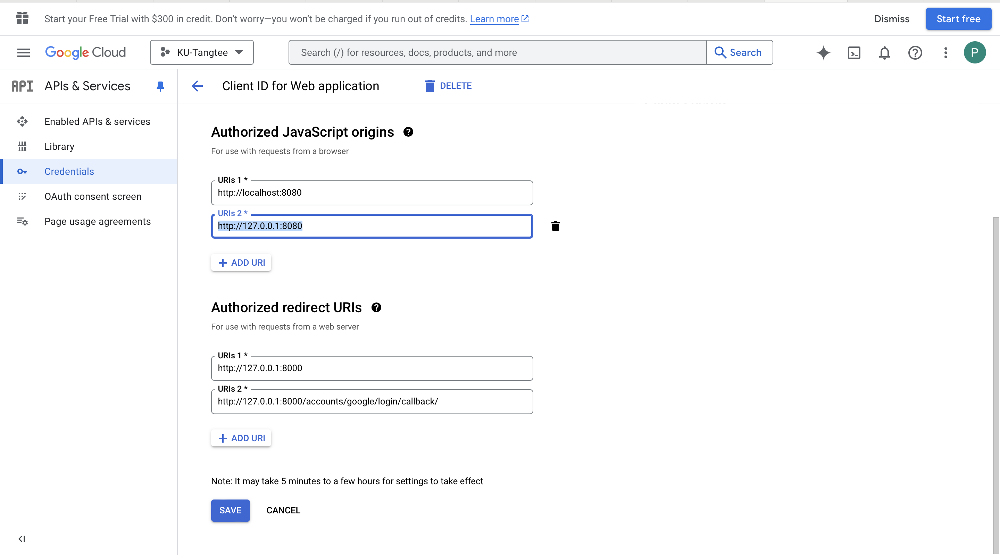

# Google oauth setup guide

## Get Google credentials

1. Go to [this link](https://console.cloud.google.com)

2. Login with a @ku.th account.

3. Select project name.
   

4. Create new project
   

5. Fill project name then click create.
   

6. Back to main page and select project name on the top of page.
   

7. Select project name that you've just created.
   

8. Create oauth consent screen. by select hamburger icon > APIs & Services > oAuth consent screen.
   

9. Select user type to be internal.
   

10. Fill App name, User support email, Developer Contact information then click save and continue
    

11. Select scope. Check email and profile checkbox then click update then scroll down to click save and continue.
    

12. After see a summary page, click credentials tab on a side bar. Then click create credentials.
    

13. Select **Web Appplication** as a application type
    

14. Scroll down and add 2 URI.

    First: `http://127.0.0.1:8000`

    Second: `http://127.0.0.1:8000/accounts/google/login/callback/`

    (optional) add 2 more URI by replace `127.0.0.1` with `localhost`

    

15. oauth credentials already created. Save client ID and Client secret somewhere.

    

## Set up social application on Django admin.

1. Create super user.
   `python manage.py create superuser`

2. Run server.
   `python manage.py runserver`

3. Go to admin page by go to `http://127.0.0.1:8000/admin/`

4. Add new site. by fill

    Domain name: `http://127.0.0.1:8000`

    Display name: `http://127.0.0.1:8000`

    Then click save.

    

5. Add social application, by select Google as a Provider, leave Provider ID blank, fill name. Get client ID and Secret key from google credentials that we've just created

    

6. scroll down then add site to social app, then click save.

    

7. Get site_id from database

    - Access mysql shell

        - MacOS

            run ```mysql -u root -p```

            Then enter you root password.

        - Window 

            Run MySQL Command Line Client application

    - Use database that you use for running the app
    
        ``` sql
        USE myDB; -- If your database name is myDB
        ```
        ``` sql
        SELECT * FROM django_site;
        ```

    - It's will show table with couple record. Look for 127.0.0.1:8000.

        For an example

        ```
        mysql> SELECT * FROM django_site;
        +----+-----------------------+-----------------------+
        | id | domain                | name                  |
        +----+-----------------------+-----------------------+
        |  3 | example.com           | example.com           |
        |  4 | http://127.0.0.1:8000 | http://127.0.0.1:8000 |
        +----+-----------------------+-----------------------+
        2 rows in set (0.00 sec)
        ```

        In this case SITE_ID is 4


8. In your .env file, there is a row `SITE_ID`. Edit it to match with your SITE_ID.

    ```
    SITE_ID = 4 // According to previous step SITE_ID is 4
    ```

## Test Google login

1. Go to 'http://127.0.0.1:8000/accounts/google/login/' and click continue it's should lead you to google login. You must login with KU account.
2. After login complete, it's should show `{"is_authen": true}` after redirect.

## Test Logout

1. Go to 'http://127.0.0.1:8000/accounts/logout/' and click continue.
2. After login complete, it's should show `{"is_authen": false}` after redirect.
